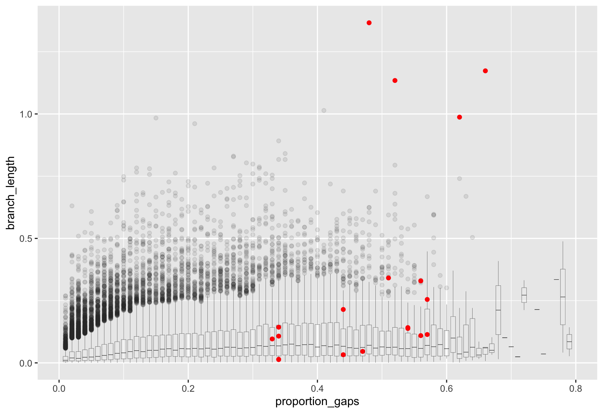

# Q.GTDB  

## Results executive summary...

I've estimated a lot of models below. The main question is how they perform on the full GTDB dataset, and here's a table for that...

All of these are fit with a +G rate model, not because I think that's best, but because that's all we have in FastTree, so that's the relevant comparison.

Within each alignment, models are ordered from worst to best.

| Alignment | Model                | Likelihood          | AIC                  | Time      | Log file                                   |
|-----------|----------------------|---------------------|----------------------|-----------|--------------------------------------------|
| Reduced   | Q.bacteria_phylum_1  | -131190357.878285   | 262629875.756571     | 1866.073  | QBp1G.raxml.log                            |
| Reduced   | Q.bacteria_class_1   | -131099420.890135   | 262448001.780271     | 1442.474  | Q.bacteria_class_1_G_reduced_aln.raxml.log |
| Reduced   | Q.insect             | -130710969.014237   | 261671098.028474     | 3368.046  | Q.insect_G_reduced.raxml.log              |
| Reduced   | Q.yeast              | -130701947.976616   | 261653055.953232     | 2285.802  | Q.yeast_G_reduced.raxml.log               |
| Reduced   | LG                   | -130592049.145638   | 261433258.291277     | 3785.556  | LGG.raxml.log                              |
| Reduced   | Q.bacteria_order_1   | -130587008.543687   | 261423177.087373     | 1382.725  | Q.bacteria_order_1_G_reduced_aln.raxml.log |
| Reduced   | Q.pfam               | -130568424.104676   | 261386008.209351     | 3871.505  | Q.pfam_G_reduced.raxml.log                |
| Reduced   | Q.GTDB_sub_1k        | -130190308.686682   | 260629777.373364     | 1921.265  | Q.GTDB_sub_1k_G_reduced_aln.raxml.log      |
| Reduced   | Q.GTDB_sub_5k        | -130187129.127843   | 260623418.255687     | 1466.727  | Q.GTDB_sub_5k_G_reduced_aln.raxml.log      |
| Full      | Q.bacteria_phylum_1  | -1088000564.208966  | 2176250288.417933    | 17965.016 | QBp1G_full.raxml.log                       |
| Full      | Q.bacteria_class_1   | -1086808724.440440  | 2173866608.880880    | 12427.577 | Q.bacteria_class_1_G_full_aln.raxml.log    |
| Full      | Q.yeast              | -1083245058.148305  | 2166739276.296611    | 18017.715 | Q.yeast_G_full.raxml.log                  |
| Full      | Q.insect             | -1083233269.103021  | 2166715698.206043    | 25808.033 | Q.insect_G_full.raxml.log                  |
| Full      | Q.bacteria_order_1   | -1082202438.322814  | 2164654036.645627    | 11859.777 | Q.bacteria_order_1_G_full_aln.raxml.log    |
| Full      | LG                   | -1081479614.701307  | 2163208389.402613    | 20892.610 | LGG_full.raxml.log                         |
| Full      | Q.pfam               | -1080441362.693915  | 2161131885.387830    | 12178.108 | Q.pfam_G_full.raxml.log                   |
| Full      | Q.GTDB_sub_1k        | -1079048060.530090  | 2158345281.060180    | 9662.451  | Q.GTDB_sub_1k_G_full_aln.raxml.log        |
| Full      | Q.bactera_sub_5k     | -1078809634.619930  | 2157868429.239860    | 11799.372 | Q.GTDB_sub_5k_G_full_aln.raxml.log         |


Brief model explanations

* **Q.bacteria_phylum_1**: one random sample per phylum, fix tree to r207
* **Q.bacteria_class_1**: one random sample per class, fix tree to r207
* **Q.bacteria_order_1**: one random sample per order, fix tree to r207
* **Q.bacteria_family_1**: one random sample per family, fix tree to r207
* **Q.bactera_sub_5k**: split tree into 673 sub-trees with up to 100 taxa, split 120 loci, randomly select 5k alignments
* **Q.bactera_sub_1k**: split tree into 673 sub-trees with up to 100 taxa, split 120 loci, randomly select 1k alignments


## Introduction

The aim for this matrix is to estimate a single amino acid matrix for the GTDB dataset.

The dataset comprises 120 genes, each for ~85K taxa. The main challenges are that this is just too many taxa. So we need to come up with sensible ways of estimating matrices from a subset of the taxa. I will use a lot of the suggestions from https://github.com/roblanf/Q.GTDB, with some modifications.

## Getting set up

Install and activate the conda environment like so:

```{bash}
conda env create -f env.yml
conda activate qgtdb
```

## Input data

For the purposes of this work, the 120 gene alignments are in:

```
/alignments
```

these aren't on GitHub - they're too big.

The pre-estimated tree for these data (estimated in FastTree using an LG model) is:

```
gtdb_r207_bac120_unscaled.decorated.tree
```

there is also a 'clean' version of this tree, without the decorations:

```
r207_original_clean.tree
```

finally, there's a big taxonomy table here:

```
gtdb_r207_bac120_curation_taxonomy.tsv
```

This file is a bit annoying. It looks like this:

```
G009834515	d__Bacteria;p__Proteobacteria;c__Gammaproteobacteria;o__Pseudomonadales;f__Pseudomonadaceae;g__Pseudomonas_E;s__Pseudomonas_E sp009834515
G900187605	d__Bacteria;p__Proteobacteria;c__Gammaproteobacteria;o__Pseudomonadales;f__Pseudomonadaceae;g__Pseudomonas_E;s__Pseudomonas_E sp900187605
G013433315	d__Bacteria;p__Proteobacteria;c__Gammaproteobacteria;o__Pseudomonadales;f__Pseudomonadaceae;g__Pseudomonas_E;s__Pseudomonas_E crudilactis
G018138145	d__Bacteria;p__Proteobacteria;c__Gammaproteobacteria;o__Pseudomonadales;f__Pseudomonadaceae;g__Pseudomonas_E;s__Pseudomonas_E koreensis_A
```

So we first process it into a taxonomy file that's tab delimited for easier processing:

```
awk 'BEGIN { FS=OFS="\t" } { gsub(";", "\t", $2) } 1' input.tsv > output.tsv
```

now it looks like this:

```
G009834515	d__Bacteria	p__Proteobacteria	c__Gammaproteobacteria	o__Pseudomonadales	f__Pseudomonadaceae	g__Pseudomonas_E	s__Pseudomonas_E sp009834515
G900187605	d__Bacteria	p__Proteobacteria	c__Gammaproteobacteria	o__Pseudomonadales	f__Pseudomonadaceae	g__Pseudomonas_E	s__Pseudomonas_E sp900187605
G013433315	d__Bacteria	p__Proteobacteria	c__Gammaproteobacteria	o__Pseudomonadales	f__Pseudomonadaceae	g__Pseudomonas_E	s__Pseudomonas_E crudilactis
G018138145	d__Bacteria	p__Proteobacteria	c__Gammaproteobacteria	o__Pseudomonadales	f__Pseudomonadaceae	g__Pseudomonas_E	s__Pseudomonas_E koreensis_A
```

## Taxonomy summary

in R...

```{R}
library(tidyverse)
tax <- read_delim("taxonomy.tsv", delim="\t", col_names = FALSE)
names(tax) <- c("id", "clade", "phylum", "class", "order", "family", "genus", "species")

unique_counts <- tax %>%
    gather(column, value) %>%                # Convert data to long format
    group_by(column) %>%                     # Group by column names
    summarise(unique_entries = n_distinct(value)) %>% # Count unique values
    arrange(unique_entries)
```

Gives:

```
> unique_counts
# A tibble: 8 × 2
  column  unique_entries
  <chr>            <int>
1 clade                1
2 phylum             169
3 class              428
4 order             1460
5 family            3650
6 genus            15342
7 id               62291
8 species          62291
```

### Assessing the distribution of gaps

Since we want to estimate substitutino models, we don't want to include genomes with too many gaps. Let's take a look at that first.

```
gtdb_r207_bac120_full.faa
```

I can then calculate gap proportions like this (for sure there are quicker and smarter ways using actual software, but I was about to go home for the evening, so this sufficed):

```{bash}
awk '/^>/ {if (seq) {print id, seq}; id=substr($1, 2); seq=""; next} {seq=seq$0} END {print id, seq}' gtdb_r207_bac120_full.faa | 
while read -r id seq; do
    total_length=$(echo -n "$seq" | wc -c)
    gap_count=$(echo -n "$seq" | sed 's/[^-]//g' | wc -c)
    gap_proportion=$(echo "scale=2; $gap_count / $total_length" | bc -l)
    echo -e "$id\t$gap_proportion"
done > gaps.tsv
```

We can look at the distribution:

```{r}
gaps <- read_delim("gaps.tsv", delim="\t", col_names = c("id", "proportion_gaps"))
ggplot(gaps, aes(x = proportion_gaps)) + geom_histogram(bins=80)
```

Let's add the gaps to the big dataset:

```{r}
tax <- tax %>%
  inner_join(gaps, by = "id")
```

Let's look at the proportion of sequences with fewer gaps than each threshold:

```{r}
results <- map_dfr(seq(0, 1, by = 0.01), function(threshold) {
  proportion_below_threshold <- mean(tax$proportion_gaps < threshold)
  tibble(threshold = threshold, proportion_below = proportion_below_threshold)
})

head(results, 40)

ggplot(results, aes(x = threshold, y = proportion_below)) +
  geom_point() +
  geom_line()
```

This shows that we lose half the data by removing everything with >10% gaps. Let's check how different thresholds would affect the number of phyla and other ranks we'd have.

```{r}

thresholds <- seq(100, 0, by = -10)

for (thresh in thresholds) {
  col_name <- paste0("unique_entries_", thresh)
  
  temp_counts <- tax %>%
    filter(proportion_gaps <= (thresh / 100)) %>%
    gather(column, value, -id, -proportion_gaps) %>%
    group_by(column) %>%
    summarise(!!col_name := n_distinct(value))
  
  unique_counts <- left_join(unique_counts, temp_counts, by = "column")
}

percentage_retained <- unique_counts[,3:12] / unique_counts$unique_entries

rownames(percentage_retained) <- unique_counts$column

```

This shows us what proportion of each rank (phylum, class, etc) is retained with different gap cutoffs:

```
> percentage_retained
        unique_entries_100 unique_entries_90 unique_entries_80 unique_entries_70 unique_entries_60 unique_entries_50 unique_entries_40 unique_entries_30 unique_entries_20 unique_entries_10
clade                    1                 1                 1         1.0000000         1.0000000         1.0000000         1.0000000         1.0000000         1.0000000         1.0000000
phylum                   1                 1                 1         1.0000000         1.0000000         0.9881657         0.9822485         0.9644970         0.8579882         0.5798817
class                    1                 1                 1         1.0000000         1.0000000         0.9953271         0.9836449         0.9485981         0.8247664         0.5490654
order                    1                 1                 1         1.0000000         1.0000000         0.9952055         0.9712329         0.9082192         0.7664384         0.4910959
family                   1                 1                 1         0.9997260         0.9986301         0.9901370         0.9602740         0.8660274         0.7216438         0.4646575
genus                    1                 1                 1         0.9997393         0.9986312         0.9866380         0.9431626         0.8473472         0.7088385         0.4561987
id                      NA                NA                NA                NA                NA                NA                NA                NA                NA                NA
species                  1                 1                 1         0.9998234         0.9983465         0.9822286         0.9328153         0.8389013         0.6966335         0.4836814
```

So a sensible cutoff here is to only keep taxa with <20% gaps - this means we keep ~70% of the species, and more than 80% of the phyla and classes are still represented.

### Assessing long branches

We  also need to assess if any taxa are on crazy long branches. This can happen if the genomes are poorly sequenced or aligned, and can be a big problem for estimating the Q matrix. So let's use TreeShrink for this.

```
run_treeshrink.py -t r207_original_clean.tree
```

Now let's look at what happened, by analysing the tree before and after:

```
scripts/tree_length.py r207_original_clean.tree
mv branch_length_histogram.png before_pruning.png
scripts/tree_length.py r207_original_clean_treeshrink/output.tree
mv branch_length_histogram.png after_pruning.png
```

Before


After


The total tree length dropped from 6908.397739999869 to 6899.0687299998635. 

Treeshrink removed 18 branches, by removing the following taxa:

```
G002325765      
G001730065      
G002682985      
G000508245      
G000277795      
G000319365      
G000281235      
G000477415      
G000179035      
G002135175      
G000238995 
G000200735       
G001645765      
G902712995      
G000008205      
G000815065      
G900660545      
G001951355      
G000218525
```

We can look at them like this

```{r}
treeshrink <- c("G002325765","G001730065","G002682985","G000508245","G000277795","G000319365","G000281235","G000477415","G000179035","G002135175","G000238995","G000200735","G001645765","G902712995","G000008205","G000815065","G900660545","G001951355","G000218525")

tax %>% filter(id %in% treeshrink)
```

```
> tax %>% filter(id %in% treeshrink)
# A tibble: 19 × 9
   id         clade       phylum            class                  order                 family                  genus               species                           proportion_gaps
   <chr>      <chr>       <chr>             <chr>                  <chr>                 <chr>                   <chr>               <chr>                                       <dbl>
 1 G002682985 d__Bacteria p__Proteobacteria c__Gammaproteobacteria o__Enterobacterales_A f__Enterobacteriaceae_A g__Tremblaya        s__Tremblaya phenacola                       0.62
 2 G001730065 d__Bacteria p__Proteobacteria c__Alphaproteobacteria o__Rickettsiales      f__AB1-6                g__AB1-6            s__AB1-6 sp001730065                         0.52
 3 G002325765 d__Bacteria p__Proteobacteria c__Alphaproteobacteria o__Rickettsiales      f__UBA1459              g__UBA1459          s__UBA1459 sp002325765                       0.66
 4 G900660545 d__Bacteria p__Firmicutes     c__Bacilli             o__Mycoplasmatales    f__Metamycoplasmataceae g__Mycoplasmopsis_A s__Mycoplasmopsis_A cynos                    0.34
 5 G000008205 d__Bacteria p__Firmicutes     c__Bacilli             o__Mycoplasmatales    f__Metamycoplasmataceae g__Mesomycoplasma   s__Mesomycoplasma hyopneumoniae              0.34
 6 G000815065 d__Bacteria p__Firmicutes     c__Bacilli             o__Mycoplasmatales    f__Metamycoplasmataceae g__Mesomycoplasma   s__Mesomycoplasma flocculare                 0.33
 7 G000218525 d__Bacteria p__Firmicutes     c__Bacilli             o__Mycoplasmatales    f__Metamycoplasmataceae g__Mesomycoplasma   s__Mesomycoplasma ovipneumoniae_A            0.34
 8 G001951355 d__Bacteria p__Firmicutes     c__Bacilli             o__Mycoplasmatales    f__Metamycoplasmataceae g__Mesomycoplasma   s__Mesomycoplasma ovipneumoniae              0.34
 9 G000277795 d__Bacteria p__Firmicutes     c__Bacilli             o__Mycoplasmatales    f__Mycoplasmoidaceae    g__Eperythrozoon_A  s__Eperythrozoon_A wenyonii                  0.56
10 G000508245 d__Bacteria p__Firmicutes     c__Bacilli             o__Mycoplasmatales    f__Mycoplasmoidaceae    g__Eperythrozoon_A  s__Eperythrozoon_A ovis                      0.57
11 G000319365 d__Bacteria p__Firmicutes     c__Bacilli             o__Mycoplasmatales    f__Mycoplasmoidaceae    g__Eperythrozoon_A  s__Eperythrozoon_A haemominutum              0.56
12 G000281235 d__Bacteria p__Firmicutes     c__Bacilli             o__Mycoplasmatales    f__Mycoplasmoidaceae    g__Eperythrozoon_A  s__Eperythrozoon_A haemolamae                0.57
13 G000179035 d__Bacteria p__Firmicutes     c__Bacilli             o__Mycoplasmatales    f__Mycoplasmoidaceae    g__Eperythrozoon_A  s__Eperythrozoon_A suis                      0.54
14 G000477415 d__Bacteria p__Firmicutes     c__Bacilli             o__Mycoplasmatales    f__Mycoplasmoidaceae    g__Eperythrozoon_A  s__Eperythrozoon_A parvum                    0.54
15 G000200735 d__Bacteria p__Firmicutes     c__Bacilli             o__Mycoplasmatales    f__Mycoplasmoidaceae    g__Eperythrozoon_B  s__Eperythrozoon_B haemofelis                0.44
16 G000238995 d__Bacteria p__Firmicutes     c__Bacilli             o__Mycoplasmatales    f__Mycoplasmoidaceae    g__Eperythrozoon_B  s__Eperythrozoon_B haemocanis                0.47
17 G001645765 d__Bacteria p__Firmicutes     c__Bacilli             o__Mycoplasmatales    f__Mycoplasmoidaceae    g__Eperythrozoon_B  s__Eperythrozoon_B haemobos                  0.44
18 G902712995 d__Bacteria p__Firmicutes     c__Bacilli             o__Mycoplasmatales    f__Mycoplasmoidaceae    g__Eperythrozoon_B  s__Eperythrozoon_B haemohominis              0.51
```

These are all species with a LOT of gaps, highlighting the issues with these kinds of taxa!


### Correlation between branch lengths and gaps

Let's check to see the scale of the problem. 

First we get the terminal branch lengths, then add them to the main tibble

```{r}
t <- read.tree("r207_original_clean.tree")
tip_names <- t$tip.label
terminal_branch_lengths <- t$edge.length[t$edge[, 2] <= length(tip_names)]
tips <- tibble(id = tip_names, branch_length = terminal_branch_lengths)

# add to main tibble
tax <- left_join(tax, tips, by = "id")
```

Now we can plot it out...

```{r}
ggplot(tax, aes(x = proportion_gaps, y = branch_length)) +
    geom_boxplot(aes(group = proportion_gaps), size = 0.1, alpha = 0.1) +
    geom_point(data = filter(tax, id %in% treeshrink), 1, colour = 'red')
```



We can see that the treeshrink taxa all have a lot of gaps, and a mild but not alarming tendency for more gaps to be associated with longer branch lengths.

## Subset taxa


### Subset by gaps

First we'll remove taxa based on our gap threshold

```{r}
subset = tax %>% 
            filter(proportion_gaps<0.20)
```

### Subset by treeshrink

Now we can remove the treeshrink taxa

```{r}
subset = subset %>% 
            filter(!id %in% treeshrink)
```

Actually this didn't remove any more taxa - they were already removed based on gaps, as expected from the plot above.

Now let's see what we've got:

```{r}
unique_counts <- subset %>%
    gather(column, value) %>%                # Convert data to long format
    group_by(column) %>%                     # Group by column names
    summarise(unique_entries = n_distinct(value)) %>% # Count unique values
    arrange(unique_entries)
```

```
> unique_counts
# A tibble: 9 × 2
  column          unique_entries
  <chr>                    <int>
1 clade                        1
2 proportion_gaps             19
3 phylum                     140
4 class                      343
5 order                     1090
6 family                    2570
7 genus                    10603
8 id                       42385
9 species                  42385
```


### One random genome per phylum

Let's start by making three Q matrices, each by selecting a single random ID from every phylum:

```{r}
sample_phylum_id <- function(data) {
  data %>%
    group_by(phylum) %>%
    sample_n(1) %>%
    ungroup() %>%
    pull(id)
}

phylum_1 <- sample_phylum_id(subset)
phylum_2 <- sample_phylum_id(subset)
phylum_3 <- sample_phylum_id(subset)

```

Then lets see how different these are:

```{r}
common_1_2 <- length(intersect(phylum_1, phylum_2))
common_1_3 <- length(intersect(phylum_1, phylum_3))
common_2_3 <- length(intersect(phylum_2, phylum_3))
```

They have 38, 41, and 44 IDs in common, respectively, so the majority (about 100) of the IDs are different between each pair. This is good. If we get very similar matrices with these three lists, that will indicate that the details of the taxon selection didn't matter much.

Let's write out these lists for future usage...

```
writeLines(phylum_1, "phylum_1.txt")
writeLines(phylum_2, "phylum_2.txt")
writeLines(phylum_3, "phylum_3.txt")
```

### One random genome per class

We can also do one random genome per class, like so:


```{r}
sample_class_id <- function(data) {
  data %>%
    group_by(class) %>%
    sample_n(1) %>%
    ungroup() %>%
    pull(id)
}

class_1 <- sample_class_id(subset)
class_2 <- sample_class_id(subset)
class_3 <- sample_class_id(subset)

```

Then lets see how different these are:

```{r}
common_1_2 <- length(intersect(class_1, class_2))
common_1_3 <- length(intersect(class_1, class_3))
common_2_3 <- length(intersect(class_2, class_3))
```

They have ~120 IDs in common, respectively, so the majority (about 200) of the IDs are different between each pair. This is good. 

Let's write out these lists for future usage...

```
writeLines(class_1, "class_1.txt")
writeLines(class_2, "class_2.txt")
writeLines(class_3, "class_3.txt")
```


### One random genome per order

We can also do one random genome per order, like so:


```{r}
sample_order_id <- function(data) {
  data %>%
    group_by(order) %>%
    sample_n(1) %>%
    ungroup() %>%
    pull(id)
}

order_1 <- sample_order_id(subset)
order_2 <- sample_order_id(subset)
order_3 <- sample_order_id(subset)

```

Then lets see how different these are:

```{r}
common_1_2 <- length(intersect(order_1, order_2))
common_1_3 <- length(intersect(order_1, order_3))
common_2_3 <- length(intersect(order_2, order_3))
```

They have ~490 IDs in common, respectively, so about half (about 500) of the IDs are different between each pair. This is OK. 

Let's write out these lists for future usage...

```
writeLines(order_1, "order_1.txt")
writeLines(order_2, "order_2.txt")
writeLines(order_3, "order_3.txt")
```


## Estimate Q Matrices with one random genome

Now we estimate a model for each of the taxon lists.

I'll walk through the first one in great detail. The rest are just bash scripts based on the first one!

### Q.phylum_1

#### 1. Make a folder and cd to it

```{bash}
mkdir phylum_1
cd phylum_1
cp ../phylum_1.txt .
```

#### 2. Get the subtree

```{bash}
../scripts/get_subtree.py r207_original_clean.tree phylum_1.txt 
```

#### 3. just get the taxa we want from the loci

```{bash}
mkdir -p loci
for loc in ../alignments/*.faa; do
    filename=$(basename $loc)
    faSomeRecords $loc phylum_1.txt loci/${filename}
done

# remove the full alignment, we don't want that!
rm loci/gtdb_r207_bac120_full.faa 
```

#### 4. Split the loci between training and testing

Here we choose at random 20 loci for testsing, which leaves 100 for training.

```{bash}
cd loci
mkdir -p training_loci
mkdir -p testing_loci

test_set=$(ls | sort -R | tail -20)

mv $test_set testing_loci
mv *.faa training_loci
cd ..
```

#### 5. Estimate the models

Now we look through all models and estimate the best model for each locus, using the original r207 sub-tree as our tree.

Here we should be careful to set the number of threads equal to (or less than, if necessary) the number of training loci.

This is just a way to keep IQ-TREE efficient (seems silly, and it is, we're working on it!!!).

The following command broken down:

* `-T 100` 100 threads (I have 100 loci, this will allocate 1 thread to each locus)
* `-p loci/training_loci` this points to my folder of 100 training loci, each in its own `.faa` file
* `-m MFP` this calls modelfinder on every locus
* `-cmax 8` this allows up to 8 free-rate categories per locus (higher is better, but takes longer)
* `-te phylum_1.tree` sets the tree to a pre-estimated tree for these loci (the same tree across all loci)
* `-pre 02_fullcon/iteration_1` sets the output directory

```{bash}
mkdir 02_fullcon # first make the output directory
iqtree2 -T 100 -p loci/training_loci -m MFP -cmax 8 -te phylum_1.tree -pre 02_fullcon/iteration_1
```

The most important output from this is the file `iteration_1.best_scheme.nex`, which has the best model for each locus in it. 

If you scroll through it, you'll see them like this:

```
  charpartition mymodels =
    LG+F+I+R7: gtdb_r207_bac120_PF00466.21.faa,
    Q.pfam+R6: gtdb_r207_bac120_PF02576.18.faa,
    LG+F+I+R8: gtdb_r207_bac120_TIGR00006.faa,
    LG+F+I+R8: gtdb_r207_bac120_TIGR00019.faa,
    LG+I+R8: gtdb_r207_bac120_TIGR00020.faa,
    rtREV+F+I+R6: gtdb_r207_bac120_TIGR00029.faa,
    LG+F+I+R8: gtdb_r207_bac120_TIGR00054.faa,
    Q.pfam+R8: gtdb_r207_bac120_TIGR00059.faa,
    LG+R6: gtdb_r207_bac120_TIGR00061.faa,
...
```

Let's check the models from that analysis:

We can do this with grep and awk...

```{bash}
grep '^ *[^ ]\+:' 02_fullcon/iteration_1.best_scheme.nex | awk -F: '{print $1}' | awk '{print $NF}' | cut -d'+' -f1 | sort | uniq -c | sort -nr
```

This gives us:

```
     61 LG
     24 Q.pfam
      7 Q.yeast
      6 Q.insect
      1 WAG
      1 rtREV
```

Importantly, this tells us that we should use the LG model as the initial model for our analysis, since it's the best fit in 61% of the loci. This means that starting with LG model parameters is likely to be our best bet at getting an even better model.

#### 7. Estimate the Q matrix

Now we estimate the first iteration fo the matrix

```{bash}
iqtree2 -T 100 -S loci/training_loci -p 02_fullcon/iteration_1.best_scheme.nex -te 02_fullcon/iteration_1.treefile --init-model LG --model-joint GTR20+FO -pre 02_fullcon/iteration_1.GTR20
```

Once this is done we can do more iterations...


#### 8. Extract the Q matrix

Let's get it out and store it away...

```{bash}
grep -A 21 "can be used as input for IQ-TREE" 02_fullcon/iteration_1.GTR20.iqtree | tail -n20 > Q.bacteria_phylum_1
```

#### 9. Test the new model on the test loci.

Now we want to know how many test loci are best fit by this model. Here I use 20 threads because I only have 20 test loci, and that keeps IQ-TREE efficient. 

The general rule is have no more threads than loci.

Here we run IQ-TREE on the test loci, then summarise the output. What we *want* to see if things worked is that our new matrix is the best for a lot of the test loci!

```{bash}
mkdir 03_testing
iqtree2 -T 20 -S loci/testing_loci/ -m MF -mset LG,Q.pfam,Q.insect,Q.yeast,Q.bacteria_phylum_1 -pre 03_testing/test_loci_mf
grep '^ *[^ ]\+:' 03_testing/test_loci_mf.best_scheme.nex | awk -F: '{print $1}' | awk '{print $NF}' | cut -d'+' -f1 | sort | uniq -c | sort -nr
```

This gives:

```{bash}
     19 Q.bacteria_phylum_1
      1 Q.yeast
```

This means it worked! The new model is a better fit to the test loci than the old one. And remember, the new model has *never* seen the test loci before, so it's a legitimate test.


#### 10. Test the new model on the whole dataset

Perhaps more importantly, we want to know if the new model fits the BIG tree better. Let's try that too.

Previous analyses (https://github.com/fredjaya/gtdb_trees/tree/a0d9ce0702487d5ecceb228e36efb208bc6182f9/v0.1.0_analyses/initial_tree_analyses) suggest that we can use raxml-ng for this quite effectively.

We'll try two good rate distributions - +G, and +R4 (there are practically no invariant columns in this data, so I ignore +I models; in addition, the end goal is to work with FastTree which has no +I option). We'll do this on two alignments: the reduced alignment that GTDB use, and the full alignment that they'd like to use but don't yet.

```{bash}

# QBp1 stands for Q.bacteria_phylum_1
# small alignment
raxml-ng --msa ../alignments/gtdb_r207_bac120_concatenated.faa --model PROTGTR{Q.bacteria_phylum_1}+G --threads 16 --force perf_threads --tree ../r207_original_clean.tree --evaluate --lh-epsilon 0.1  --prefix 03_testing/QBp1G

raxml-ng --msa ../alignments/gtdb_r207_bac120_concatenated.faa --model LG+G --threads 16 --force perf_threads --tree ../r207_original_clean.tree --evaluate --lh-epsilon 0.1  --prefix 03_testing/LG

# big alignment
raxml-ng --msa ../alignments/gtdb_r207_bac120_full.faa --model PROTGTR{Q.bacteria_phylum_1}+G --threads 16 --force perf_threads --tree ../r207_original_clean.tree --evaluate --lh-epsilon 0.1  --prefix 03_testing/QBp1G_full

raxml-ng --msa ../alignments/gtdb_r207_bac120_full.faa --model LG+G --threads 16 --force perf_threads --tree ../r207_original_clean.tree --evaluate --lh-epsilon 0.1  --prefix 03_testing/LGG_full

```

Now we want to extract the relevant info from these analyses: likelihoods, AICs, execution times.

```{bash}
# Specify your list of filenames
declare -a filenames=("QBp1G_full.raxml.log" "LGG_full.raxml.log" "QBp1G.raxml.log" "LGG.raxml.log")

cd 03_testing

# Create a new file to store the table
log_file="log_table.txt"

# Print the header of the table
echo -e "Likelihood\tAIC\tTime\tFilename" > "$log_file"

# Loop through each specified file
for file in "${filenames[@]}"; do
    # Check if the file exists
    if [[ -f "$file" ]]; then
        # Extract the required values using grep and awk
        likelihood=$(grep 'Final LogLikelihood' "$file" | awk '{print $3}')
        aic=$(grep 'AIC score' "$file" | awk '{print $3}')
        time=$(grep 'Elapsed time' "$file" | awk '{print $3}')
        filename=$(basename "$file")

        # Append the extracted values to the log file
        echo -e "$likelihood\t$aic\t$time\t$filename" >> "$log_file"
    else
        echo "The file $file does not exist." >> "$log_file"
    fi
done

# Display the table
cat "$log_file"

cd ..

cat 03_testing/$log_file >> log.txt
```

This gives us:

```{bash}
Likelihood      AIC     Time    Filename
-1088000564.208966      2176250288.417933       17965.016       QBp1G_full.raxml.log
-1081479614.701307      2163208389.402613       20892.610       LGG_full.raxml.log
-131190357.878285       262629875.756571        1866.073        QBp1G.raxml.log
-130592049.145638       261433258.291277        3785.556        LGG.raxml.log
```


Which is bad news - it shows us that the new matrix fits worse than LG on both the full matrix AND the reduced matrix!

I'll also just fit the other common models for reference, Q.insect, Q.yeast, and Q.pfam

```{bash}
raxml-ng --msa ../concat_alignments/gtdb_r207_bac120_full.faa --model Q.insect+G --threads 16 --force perf_threads --tree ../r207_original_clean.tree --evaluate --lh-epsilon 0.1 --prefix 03_testing/Q.insect_G_full

raxml-ng --msa ../concat_alignments/gtdb_r207_bac120_full.faa --model Q.pfam+G --threads 16 --force perf_threads --tree ../r207_original_clean.tree --evaluate --lh-epsilon 0.1 --prefix 03_testing/Q.pfam_G_full

raxml-ng --msa ../concat_alignments/gtdb_r207_bac120_full.faa --model Q.yeast+G --threads 16 --force perf_threads --tree ../r207_original_clean.tree --evaluate --lh-epsilon 0.1 --prefix 03_testing/Q.yeast_G_full

raxml-ng --msa ../concat_alignments/gtdb_r207_bac120_concatenated.faa --model Q.insect+G --threads 16 --force perf_threads --tree ../r207_original_clean.tree --evaluate --lh-epsilon 0.1 --prefix 03_testing/Q.insect_G_reduced

raxml-ng --msa ../concat_alignments/gtdb_r207_bac120_concatenated.faa --model Q.yeast+G --threads 16 --force perf_threads --tree ../r207_original_clean.tree --evaluate --lh-epsilon 0.1 --prefix 03_testing/Q.yeast_G_reduced

raxml-ng --msa ../concat_alignments/gtdb_r207_bac120_concatenated.faa --model Q.pfam+G --threads 16 --force perf_threads --tree ../r207_original_clean.tree --evaluate --lh-epsilon 0.1 --prefix 03_testing/Q.pfam_G_reduced

```


### Q.phylum_1_onemod

What if we try without partitions?


```
iqtree2 -T 100 -s loci/training_loci -m MFP -cmax 8 -mset LG -mrate G -m LG+G -te phylum_1.tree -pre 02_fullcon_onemod/iteration_1

iqtree2 -T 100 -s loci/training_loci -te 02_fullcon/iteration_1.treefile --init-model LG --model-joint GTR20+FO -pre 02_fullcon_onemod/iteration_1.GTR20
```

This means that we clearly need an approach that samples differently. Likely the problem here is that the samples are too sparse, so the obvious thing is to sample more densely if we can.


I want to try again with the same phylum dataset, this time bearing in mind the limitation of the end usage. The end usage here is FastTree, which does not cope with partitioned models. Instead, it fits a gamma rate distribution and assumes one model for the whole dataset. We can also try that when estimating the rate matrix, in other words, we constrain all the other parameters so that they match the constraints of the final analysis. Let's see if it makes a difference.

tbc...

### Q.class_1

Let's do the same for the class_1.txt list, but this time with a single bash script...


#### Estimating it

I'll write a very very simple log file as I go, so I can see if things go wrong.

```{bash}

analysis="class_1"

# 1. set up
mkdir $analysis
cd $analysis

echo "Setting up analysis for "$analysis > log.txt

cp ../$analysis.txt .

# 2. get the subtree (produces $analysis.tree)

echo "Getting subtree for "$analysis".txt taxon list" >> log.txt

../scripts/get_subtree.py ../r207_original_clean.tree $analysis.txt 


# 3. just get the taxa we want from the loci

echo "Subsetting alignments" >> log.txt

mkdir -p loci
for loc in ../alignments/*.faa; do
    filename=$(basename $loc)
    faSomeRecords $loc $analysis.txt loci/${filename}
done

# remove the full alignment, we don't want that!
rm loci/gtdb_r207_bac120_full.faa 


# 4. Split the loci between training and testing


echo "splitting alignments into testing and training" >> log.txt

cd loci
test_set=$(ls | sort -R | tail -20)

echo "Test alignments: " >> log.txt
echo $test_set >> log.txt

mkdir -p training_loci
mkdir -p testing_loci


mv $test_set testing_loci
mv *.faa training_loci
cd ..

# check! 

echo "Number of training loci : " >> log.txt
ls loci/training_loci/ | wc -l >> log.txt

echo "Number of testing loci : " >> log.txt
ls loci/testing_loci/ | wc -l >> log.txt

# 5. Estimate the models

echo "Estimating initial models with IQ-TREE2" >> log.txt

mkdir 02_fullcon # first make the output directory
iqtree2 -T 100 -p loci/training_loci -m MFP -cmax 8 -te $analysis.tree -pre 02_fullcon/iteration_1

# get the list of models, and save it to models.txt
grep '^ *[^ ]\+:' 02_fullcon/iteration_1.best_scheme.nex | awk -F: '{print $1}' | awk '{print $NF}' | cut -d'+' -f1 | sort | uniq -c | sort -nr > 02_fullcon/models.txt

echo "List of models best fit to training loci: " >> log.txt
cat 02_fullcon/models.txt >> log.txt

# now we get the init model as the first model in that list

initial_model=$(awk 'NR==1 {print $2}' 02_fullcon/models.txt)
echo "Initial Model will be set to" >> log.txt
echo $initial_model >> log.txt

# 7. Estimate the Q matrix

echo "Estimating Q matrix with IQ-TREE2" >> log.txt

iqtree2 -T 100 -S loci/training_loci -p 02_fullcon/iteration_1.best_scheme.nex -te 02_fullcon/iteration_1.treefile --init-model $initial_model --model-joint GTR20+FO -pre 02_fullcon/iteration_1.GTR20

```

The final step is the longest, and took ~46 hours, which is not too bad. Now to test it. 

#### Testing it

Let's write another simple bash script for testing...


```{bash}
analysis="class_1"
new_model="Q.bacteria_"$analysis

cd $analysis

# extract the matrix
echo "" >> log.txt
echo "## Model Testing ##" >> log.txt
echo "Extracting model and saving to "$new_model >> log.txt

grep -A 21 "can be used as input for IQ-TREE" 02_fullcon/iteration_1.GTR20.iqtree | tail -n20 > $new_model

cat $new_model >> log.txt

# test it on test loci
echo ""
echo "Testing model on test loci..." >> log.txt
echo "Frequency table of best-fit models" >> log.txt
mkdir 03_testing
iqtree2 -T 20 -S loci/testing_loci/ -m MF -mset LG,Q.pfam,Q.insect,Q.yeast,$new_model -pre 03_testing/test_loci_mf
grep '^ *[^ ]\+:' 03_testing/test_loci_mf.best_scheme.nex | awk -F: '{print $1}' | awk '{print $NF}' | cut -d'+' -f1 | sort | uniq -c | sort -nr >> log.txt

# test it on the full and the reduced datasets
# we don't need to do LG since we did that for phylum_1...

# small alignment
raxml-ng --msa ../alignments/gtdb_r207_bac120_concatenated.faa --model PROTGTR{$new_model}+G --threads 16 --force perf_threads --tree ../r207_original_clean.tree --evaluate --lh-epsilon 0.1  --prefix 03_testing/$new_model"_G_reduced_aln"

# big alignment
raxml-ng --msa ../alignments/gtdb_r207_bac120_full.faa --model PROTGTR{$new_model}+G --threads 16 --force perf_threads --tree ../r207_original_clean.tree --evaluate --lh-epsilon 0.1  --prefix 03_testing/$new_model"_G_full_aln"

# finally we make a little table of the likelihoods etc. for the analyses, and compare it to LG

# Specify your list of filenames
f1=$new_model"_G_reduced_aln.raxml.log"
f2="../../phylum_1/03_testing/LGG.raxml.log"
f3=$new_model"_G_full_aln.raxml.log"
f4="../../phylum_1/03_testing/LGG_full.raxml.log"
declare -a filenames=($f1 $f2 $f3 $f4)

cd 03_testing

# Create a new file to store the table
log_file="log_table.txt"

# Print the header of the table
echo -e "Likelihood\tAIC\tTime\tFilename" > "$log_file"

# Loop through each specified file
for file in "${filenames[@]}"; do
    # Check if the file exists
    if [[ -f "$file" ]]; then
        # Extract the required values using grep and awk
        likelihood=$(grep 'Final LogLikelihood' "$file" | awk '{print $3}')
        aic=$(grep 'AIC score' "$file" | awk '{print $3}')
        time=$(grep 'Elapsed time' "$file" | awk '{print $3}')
        filename=$(basename "$file")

        # Append the extracted values to the log file
        echo -e "$likelihood\t$aic\t$time\t$filename" >> "$log_file"
    else
        echo "The file $file does not exist." >> "$log_file"
    fi
done

# Display the table
cat "$log_file"

cd ..

cat 03_testing/$log_file >> log.txt

```


The results for this show that this matrix doesn't work either (though it's still better than the phylum level matrix)

Combining the results tables...

```
Likelihood      AIC     Time    Filename
-131190357.878285       262629875.756571        1866.073        QBp1G.raxml.log
-131099420.890135       262448001.780271        1442.474        Q.bacteria_class_1_G_reduced_aln.raxml.log
-130592049.145638       261433258.291277        3785.556        LGG.raxml.log
-1088000564.208966      2176250288.417933       17965.016       QBp1G_full.raxml.log
-1086808724.440440      2173866608.880880       12427.577       Q.bacteria_class_1_G_full_aln.raxml.log
-1081479614.701307      2163208389.402613       20892.610       LGG_full.raxml.log
-1078809634.619930      2157868429.239860       11799.372       Q.GTDB_sub_5k_G_full_aln.raxml.log
```

### Q.order_1

Now let's start a matrix running which is estimated by order. To do this, I'll save the above as a bash script called `order_1.sh`, change the first line to

```{bash}
analysis="order_1"
```

These alignments are big, and estimating models will be very expensive (particularly free rate models).

So I'll also look at just four models here, based on the previous analyses, by changing the script to:

```{bash}
model_set="LG,Q.pfam,Q.insect,Q.yeast"

mkdir 02_fullcon # first make the output directory
iqtree2 -T 100 -p loci/training_loci -m MFP -cmax 8 -mset $model_set -te $analysis.tree -pre 02_fullcon/iteration_1
```

I chose these models because in the phylum level analysis they represented 98% of genes, and in the class-level analysis they represented 100% of genes.

Now I can just set it running with

```{bash}
bash order_1.sh
```

And now we can test it with the testing script above after changing the first line to:

```{bash}
analysis="order_1"
```


### Q.family_1

Can we estimate a matrix with one genome per family? In the subset dataset there are 2570, which is about 2.5x bigger than the order level dataset. One way to guess how long this will take is to look at the previous runs sizes and execution times.

```{r}
times <- tibble(
  matrix = c("Q.order_1", "Q.class_1", "Q.phylum_1"),
  time_hrs = c(87, 46, 16),
  taxa = c(1090, 343, 140)
)
```
Encouragingly, this is sub-linear. So we can guesstimate that the family level matrix will take 2.5x 87hrs, which is ~220 hrs or 10 days. 

Let's try. 

```{r}
family_1 <- subset %>%
    group_by(family) %>%
    sample_n(1) %>%
    ungroup() %>%
    pull(id)
writeLines(family_1, "family_1.txt")

```


### Q.genus_1

Let's also try one per genus, just for fun


```{r}
genus_1 <- subset %>%
    group_by(genus) %>%
    sample_n(1) %>%
    ungroup() %>%
    pull(id)
writeLines(genus_1, "genus_1.txt")
```

## Q.GTDB_sub: Estimate Q Matrices from subtrees

### Splitting into subtrees

The matrices above eventually worked, but I suspect we can do more. 

We can try to include many more of the branches near the tips, by splitting the input tree into a series of subtrees, where each subtree is some maximum size. There's a tradeoff here, because we will lose taxa on trees with <4 species. However, it's an empirical question as to how much that matters, and the first challenge is to be able to split the input tree into subtrees at all. 


Let's start with an algorithm to split the big tree into smaller ones:

```{r}
library(castor)

split_tree <- function(tree, Nmax = 1000, Nmin = 4){
  
  to_split = list(tree)
  to_keep = list() # we'll put trees to keep here
  
  # we don't need to do anything if the input tree is already small enough  
  if(Ntip(tree)<=Nmax){
    return(c(tree))
  }
  
  while(length(to_split)>0){
    
    cat("to split: ", length(to_split), "    to keep: ", length(to_keep), "\n")
    
    # poor man's pop: get the first element and delete it
    t = to_split[[1]]
    to_split[[1]] <- NULL
    
    # split the tree (this is effectively just splitting it at the root node of the tree)
    splits <- split_tree_at_height(t, 0.00000000000000000000000000000001)
    # extract the subtrees from the castor object
    subtrees = sapply(splits$subtrees, function(x) x$tree, simplify = FALSE)
    
    for(subtree in subtrees){
      
      if( Ntip(subtree) > Nmax ){ # split it again...
        to_split[[length(to_split) + 1]] <- subtree
      } else if ( Ntip(subtree) > (Nmin - 1)){ # it's between 4 and N, which is what we want
        to_keep[[length(to_keep) + 1]] <- subtree
      } 
      # otherwise we ditch the tree because it has <=3 tips
    }
  }
  
  class(to_keep) <- 'multiPhylo'
  return(to_keep)
}
```

This works up from the root, and keep splitting subtrees when they are bigger than the maximum value. It keeps any subtree which is smaller than the maximum value but at least as big as the minimum.

For example, we can run it on the big tree like so:

```{r}
tree <- read.tree(r207_original_clean.tree)
subtrees <- split_tree(tree, 100, 20)
```

This gives 970 trees, which have quite a uniform distribution of sizes from 20 to 100
Remarkably, they include 55517 of the 62291 taxa, or about 90%. The tree lengths are also sensible:

```
tree_lengths <- sapply(subtrees, function(tree) sum(tree$edge.length))
#> summary(tree_lengths)
#   Min. 1st Qu.  Median    Mean 3rd Qu.    Max. 
# 0.1692  2.3551  4.4316  5.9376  7.8711 40.0413 
```

A challenge here is that we now have 970 subtrees (a little bit less when we use the filtered dataset). Since we have 120 genes, that means we have of the order of 100,000 alignments. That's a lot! The smart thing to do here is probably to treat this as its own empirical problem. How many do we need to estimate a good matrix? 

One approach is to first make the 100K alignments, and then to try various training set sizes and look at the characteristics of the resulting matrix.

Let's go!

### Creating the sub-alignments and sub-trees

First we get the subtrees only from the subset of taxa we actually care about (recall above that we removed taxa with a lot of gaps, and those on long branches).

```{r}
tree <- read.tree("r207_original_clean.tree")

to_keep = subset$id

subtree = get_subtree_with_tips(tree, only_tips = to_keep)$subtree

```

No we subdivide that subtree into trees of 20-100 taxa.

```{r}
subtrees <- split_tree(subtree, 100, 20)
```

Check the distributions

```{r}
tree_lengths <- sapply(subtrees, function(tree) max(tree$edge.length))
tips <- sapply(subtrees, function(tree) Ntip(tree))
summary(tree_lengths)
#   Min. 1st Qu.  Median    Mean 3rd Qu.    Max. 
#0.00752 0.11794 0.20503 0.24104 0.31827 0.85776 
summary(tips)
#   Min. 1st Qu.  Median    Mean 3rd Qu.    Max. 
#  20.00   34.00   53.00   56.35   79.00  100.00 
```

The trees contain a total of 37921 tips. That's 90% of the input tree, or 60% of the original dataset. 

Now let's export those trees, and their taxon lists.

```{bash}
mkdir Q.GTDB_sub
```

```{r}
write_trees_and_taxa <- function(multiphylo_trees, folder_path) {
  for (i in seq_along(multiphylo_trees)) {
    # Format the file names with leading zeros
    tree_file_name <- sprintf("%03d.tree", i)
    taxa_file_name <- sprintf("%03d.txt", i)
    
    # Write the tree to file
    write.tree(multiphylo_trees[[i]], file.path(folder_path, tree_file_name))
    
    # Write the taxon list to file
    taxa <- multiphylo_trees[[i]]$tip.label
    writeLines(taxa, con = file.path(folder_path, taxa_file_name))
  }
}

# Usage: replace "path/to/folder" with the desired folder path
write_trees_and_taxa(subtrees, "Q.GTDB_sub")
```

### Building the Q matrix

THe script for building the Q matrix will be quite different in places. Here it is

```{bash}
analysis="Q.GTDB_sub"

echo "Setting up analysis for "$analysis > log.txt

# 3. just get the taxa we want from the loci

echo "Subsetting alignments" >> log.txt

mkdir -p loci
for taxon_list in taxon_lists/*.txt; do
  
    base_name=$(basename "$taxon_list" .txt)
  
    for loc in ../alignments/*.faa; do
        filename=$(basename $loc)
        new_filename="${base_name}_${filename}"

        faSomeRecords $loc $taxon_list loci/${new_filename}
        
    done
done

echo "" >> log.txt
echo "Sub-alignments created for each gene and taxon list." >> log.txt
alignment_count=$(find loci/ -name "*.faa" | wc -l)
echo "A total of $alignment_count alignments were created." >> log.txt
```

Next we'll determine 1000 testing loci, and then we'll start with 1000 training loci. I'll make a series of training folders, so that I can train a number of matrices using different sized training datasets.

```{bash}
# 4. Split the loci between training and testing

echo "splitting alignments into testing and training" >> log.txt


test_set=$(ls loci | sort -R | tail -1000)

echo "Test alignments: " >> log.txt
echo $test_set >> log.txt
mkdir -p testing_loci
for file in $test_set; do
    mv "loci/$file" testing_loci/
done

# now we need to de-duplicate the remaining loci. No training comes from duplicates...
# we then remove any files with <10 sequences
# we also remove any sequences that are all gaps

mkdir loci_deduped
mkdir loci_clean
for file in loci/*; do
    fname=$(basename $file)
    seqkit rmdup --by-seq -o loci_deduped/$fname $file
    seqkit grep -w 0 -svrp "^-+$" loci_deduped/$fname > loci_clean/$fname # remove sequences that are all gaps
    nseq=$(grep -c '>' loci_clean/$fname)  # -c will count the number of matches
    echo "$nseq sequences left"
    if [ "$nseq" -lt 10 ]; then
        rm loci_clean/$fname
    fi    
done

# clean up!
rm -rf loci_deduped

mkdir -p training_loci_100 # for testing!
mkdir -p training_loci_1k
mkdir -p training_loci_5k
mkdir -p training_loci_10k
mkdir -p training_loci_50k
training_set100=$(ls loci_clean | sort -R | tail -100)
training_set1k=$(ls loci_clean | sort -R | tail -1000)
training_set5k=$(ls loci_clean | sort -R | tail -5000)
training_set10k=$(ls loci_clean | sort -R | tail -10000)
training_set50k=$(ls loci_clean | sort -R | tail -50000)

for file in $training_set100; do 
    cp "loci_clean/$file" training_loci_100/
done


for file in $training_set1k; do 
    cp "loci_clean/$file" training_loci_1k/
done

for file in $training_set5k; do 
    cp "loci_clean/$file" training_loci_5k/
done

for file in $training_set10k; do 
    cp "loci_clean/$file" training_loci_10k/
done

for file in $training_set50k; do 
    cp "loci_clean/$file" training_loci_50k/
done


# check! 

echo "" >> log.txt
echo "Number of testing loci : " >> log.txt
ls testing_loci/ | wc -l >> log.txt

echo "" >> log.txt
echo "Number of training loci : " >> log.txt
alignment_count=$(find loci/ -name "*.faa" | wc -l)

n100=$(find training_loci_100/ -name "*.faa" | wc -l)
n1k=$(find training_loci_1k/ -name "*.faa" | wc -l)
n5k=$(find training_loci_5k/ -name "*.faa" | wc -l)
n10k=$(find training_loci_10k/ -name "*.faa" | wc -l)
n50k=$(find training_loci_50k/ -name "*.faa" | wc -l)
echo "training_loci_100: $n100" >> log.txt
echo "training_loci_1k: $n1k" >> log.txt
echo "training_loci_5k: $n5k" >> log.txt
echo "training_loci_10k: $n10k" >> log.txt
echo "training_loci_50k: $n50k" >> log.txt


```

Now we estimate the models, but we need to do this once for every training dataset.

## Q.GTDB_sub_5k

This analysis is laid out in `Q.GTDB_sub_5k.sh`

## Q.GTDB_sub_1k

The 5k model works well, but maybe we can get away with a lot fewer training alignments, let's see. If so, it will make future directions a bit easier. For example, it may be possible to improve the matrix further by increasing the maximum size of the tree for each training locus. This will incur a lot of extra analysis time though, so it's worth looking at how much we really need to 5k loci.

This analysis is laid out in `Q.GTDB_sub_1k.sh`


## Q.GTDB_sub250: Estimate Q Matrices from subtrees of up to 250 taxa

The previous analysis split the big tree into trees of up to 100 taxa, and removed gappy taxa first. 

This analysis will be very similar, except that it will split into larger subtrees of up to 250 taxa, and we don't need to remove gappy taxa first, since how gappy a taxon is across the whole dataset doesn't actually matter much. 

### Creating the sub-alignments and sub-trees

We follow the same approach as above, except we don't remove all the gappy taxa this time. We only remove the treeshrink taxa

```{r}
tree <- read.tree("r207_original_clean.tree")

subset250 = tax %>% 
            filter(!id %in% treeshrink)

to_keep = subset250$id

subtree = get_subtree_with_tips(tree, only_tips = to_keep)$subtree

subtrees <- split_tree(subtree, 250, 20)
```

Check the distributions

```{r}
tree_lengths <- sapply(subtrees, function(tree) max(tree$edge.length))
tips <- sapply(subtrees, function(tree) Ntip(tree))
summary(tree_lengths)
   Min. 1st Qu.  Median    Mean 3rd Qu.    Max. 
0.01233 0.16783 0.26804 0.30852 0.40595 1.01401 
summary(tips)
   Min. 1st Qu.  Median    Mean 3rd Qu.    Max. 
     20      46      93     113     178     250 
```

The trees contain a total of 60028 tips. That's 96% of the input tree and the original dataset (since we only removed a few treeshrink taxa from the original this time) 

Now let's export those trees, and their taxon lists.

```{bash}
mkdir Q.GTDB_sub250
mkdir Q.GTDB_sub250/subtrees
mkdir Q.GTDB_sub250/taxon_lists
```

I slightly edited the write_trees_and_taxa function for this:

```{r}
write_trees_and_taxa <- function(multiphylo_trees, folder_path) {
  for (i in seq_along(multiphylo_trees)) {
    # Format the file names with leading zeros
    tree_file_name <- sprintf("%03d.tree", i)
    taxa_file_name <- sprintf("%03d.txt", i)
    
    # Write the tree to file
    write.tree(multiphylo_trees[[i]], file.path(folder_path, "subtrees", tree_file_name))
    
    # Write the taxon list to file
    taxa <- multiphylo_trees[[i]]$tip.label
    writeLines(taxa, con = file.path(folder_path, "taxon_lists", taxa_file_name))
  }
}

write_trees_and_taxa(subtrees, "Q.GTDB_sub250")
```

Next we create the alignments, as above. Based on the previous analysis, I just build datasets for 1K, 5K, and 10K loci here.

I wrote this into a script called `setup_alignments.sh`, based on the bash code for doing this above.

### Q.GTDB_sub250_5k

This is the matrix trained on 5k input alignments. The script is `Q.GTDB250_sub_5k.sh`. Let's see how this one goes before going further.

One good option here might be (let's see) to train this matrix, then to use it as an input matrix for the 10K dataset. This is OK because teh test alignments are already separated.


